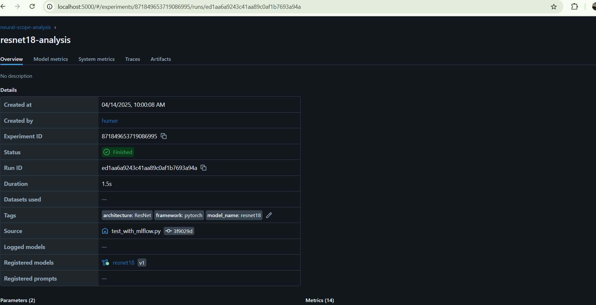
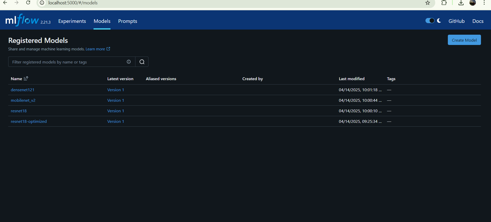

# Neural-Scope Images Gallery

This gallery showcases various visualizations and screenshots from Neural-Scope.

## Model Analysis and Optimization

*Model Architecture Visualization*

*Performance Metrics*

## Security Analysis and Robustness Testing

*Vulnerability Detection*

*Adversarial Examples*

## MLflow Integration

*Experiment Tracking*

*Model Registry*

## CI/CD Integration

*GitHub Actions Workflow*

*Jenkins Pipeline*

## Additional Visualizations

*Model Comparison*

*Optimization Results*
